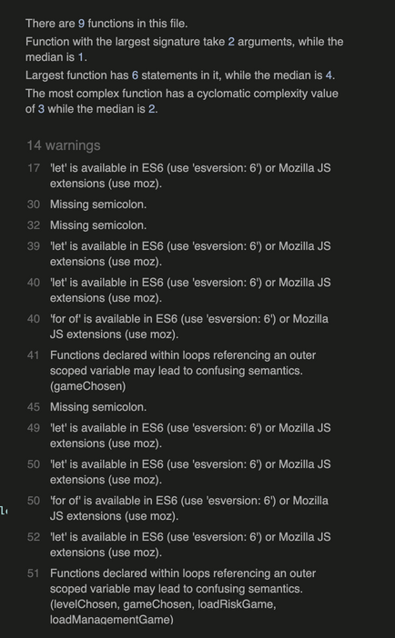

# Fund Centre Learning Game Website

## Introduction

The Fund Centre Learning Game Website was created to enable colleagues of New Ireland Assurance and Bank of Ireland Life to improve their product knowledge in a fun and iteractive way to assist them serving customers brillantly. 

View Live Website [here](https://jojo157.github.io/FundCentreGame/)

Image created using [Am I responsive](http://ami.responsivedesign.is/)

## Table of Contents

- [UX](#ux)
  - [Strategy](#strategy)
    - [User Needs](#user-needs)
        - [As a site user](as-a-site-user)
        - [As the business owner](as-the-business-owner)
  - [Scope](#scope)
    - [Features](#features)
    - [Future Features](#future-features)
  - [Structure](#structure)
  - [Skeleton](#skeleton)
  - [Surface](#surface)
    - [Colour Scheme](#colour-scheme)
    - [Typography](#typography)
    - [Images](#images)
- [Testing](#testing)
    - [Code Validation](#code-validation)
        - [Html](#html)
        - [CSS](#css)
        - [Javascript](#javascript)
    - [Performance Testing](#performance-testing)
    - [User Stories Testing](#user-stories-testing)
    - [Functionality Testing](#functionality-testing)
    - [Validation Testing](#validation-testing)
    - [Compatibility Testing](#compatibility-testing)
        - [Different devices](#different-devices)
        - [Different Browsers](#different-browsers)
        - [Different Operating Systems](#different-operating-systems)
- [Technologies Used](#technologies-used)
    - [Frameworks and Libraries](#frameworks-and-libraries)
    - [Version Control](#version-control)
    - [Other Programs](#other-programs)
- [Deployment](#deployment)
- [Credits](#credits)
    - [Code](#code)
    - [Content](#content)
    - [Media](#media)
    - [Acknowledgements](#acknowledgements)

## UX

The 5 planes of User Experience:

### Strategy

The Fund Centre Game was created with the purpose of providing a solution to make it easy and fun for our sales and customer support colleagues to become more familiar with our investment fund offering. The game will help to associate the risk level and management style with the funds we offer. Game-based learning has been shown to be a more effective trainning method than e-learning. An employee will perform better on a learning task when presented with the learning in an engaged and stimulating nature. 

#### User Needs

##### As a site user
- I want to be able to learn about the funds available and the risk that fund has.
- I want to be able to learn the fund management style in an effortless way.
- I want to contact the site owner if I want to request more information about any particular funds or give feedback.
- I want to be able to increment my knowledge at a pace that suits me. 
- I want to feel encourage to continue learning. 

##### As the business owner
- I want my employess to engage with the funds that we offer to learn the risk and management style.
- I want them to go to our fund centre website to learn more after completing the game.
- I want my employess to be able to upskill in a flexible manner by offering a website that is accessible outside the intranet.

### Scope

#### Features 

The following features are in scope for this project.

- Game Instructions
    - Clear instructions to guide the user on how to play.
- Contact Form
    - A contact form to allow the user to send a message directly to the site owner. An API will send this form data to the site owner by email.
- Game setup Page
    - This allows the user to select the game and the game level. The relevant game then loads.
- Fund Risk Game
    - The user will be presented with a random fund and risk level options and alerted when get question right or wrong. 
- Fund Management Style Game
    - The user will be presented with a random fund and management style options and alerted when get question right or wrong.   
- Game Level Option
    - The user can choose between Easy, Medium and Hard Game Level.
- Score card
    - During an active game, the user can see the number of correct and incorrect answers. At the end of a game, the user will be given their correct score. The user is also shown the total number of questions in the game, so they know how many they have left to complete the game. 
- Restart button
    - The user can choose to restart a game at any time.
- Home Button
    - The user can navigate to the home page and decide to change game or level at any stage when in an active game. The page logo also acts to allow the user to return to the home page at any stage. 
- Sound Alerts
    - When a user gets an answer wrong, they are given a wrong beep sound and the correct answer is shown. When a user gets an answer right, they get a positive sound and congratulated. 

#### Future Features 

The following features are not in scope for this project:

- Player leaderboard
    - When I learn more about databases, I would like to add a leaderboard page that when a game finishes the user can submit their score and level to the leaderboard. This would encourage learning by adding a competitve nature between colleagues. By using a database the data can be stored and would update for each user that plays.

### Structure

During the planning stage, it was decided that the following pages would be needed to ensure the user needs are meet:

- Landing Page
    - With elements to tell user how to play.
    - With elements to give user the options to choose game and level.
    - With elements to allow user to contact site owner.

- Game Page
    - With area to show the random fund.
    - With area to give the user answer options.
    - With a score area.
    - With controls to navigate.
    - With area to give the correct answer, when wrong answer chosen.

### Skeleton

Wireframes for this project were created using Balsamiq and can be viewed at below link.

Link to [Wireframe](Assets/Wireframes/fundCentreWireframes.pdf)

### Surface

The Fund Centre Game was designed to be consistent with New Ireland Assurance's Website. By replicating the main colour scheme and styling, the aim is to create an automatic association with New Ireland Assurance's brand. 

#### Colour Scheme

To obtain the hex colours used on [New Ireland Assurance website](https://www.newireland.ie/) , the tool [Color Combos](https://www.colorcombos.com) was used.

#### Typography

To minic the text styling found on New Ireland Assurance's website, I used Google Developer tools to check the font family used for different text sections.

The New Ireland Assurance website uses Din Pro for headings and Verdana for general text. As these texts were not available in goggle fonts, I found free alternatives that matched the styling. For Din Pro , I used Roboto Condensed and for Verdana, I used open sans. 

#### Images

I wanted to use a logo that was relevant to a game about investment funds. The image chosen represents a bear and bull market. A bear market is when stock prices are continually decreasing, whereas a bull market is when stock prices are continually increasing. The number of images user was kept to a minimum to increase website performance. 

## Testing

### Code Validation

#### Html

Html pages were validated with [W3C Html Checker](https://validator.w3.org/nu/). 

All pages were successful to have no errors. All pages gave the Warning : The type attribute is unnecessary for Javascript resources.

After doing some searching online I discovered that with html5 the need for type was made redundant. To ensure I am keeping with the most up to date standards and my code is complaint, I removed the type attribute and re-tested the code. All pages showed no errors or warnings. 

#### CSS

CSS page was validated with [W3C CSS Validator](https://jigsaw.w3.org/css-validator/)

No errors were found. 14 warnings were given for: -webkit-flex-direction is an unknown vendor extension. After looking up this warning, the consesus from the coding community is that it can be ignored as the extension makes the code compatible with older browsers but for newer browsers one doesnt need this CSS. 

#### Javascript

Javascript files were validated with [JSHint](https://jshint.com/)

Errors
- Undefined variable $
    - As JSHint was not aware jquery is being used, I needed to add const $ = window.$ to the beginning of my javascript files to prevent an error occuring.

Warnings
- 'let' is available in ES6 (use 'esversion: 6') or Mozilla JS extensions (use moz). 
    - to fix this warning, i added /*jshint esversion: 6 */ to all of my Javascript files as recommended. 
- Warnings were given for missing semi-colons . 
    - These were updated accordingly. 
- Functions declared within loops referencing an outer scoped variable may lead to confusing semantics.
    - ..........

After following the guidance provided and re-running all javascript files through validation, no warnings or errors were present as shown below.

### Performance Testing

Performance was tested using Lighthouse, one of Google web developer tools.

#### Home Page

#### Set up Game Page

#### Risk Game Page

#### Fund Management Game Page

#### Contact Page

### User Stories Testing

### Functionality Testing
   
### Validation Testing

### Compatibility Testing

#### Different devices

#### Different Browsers

#### Different Operating Systems
  
