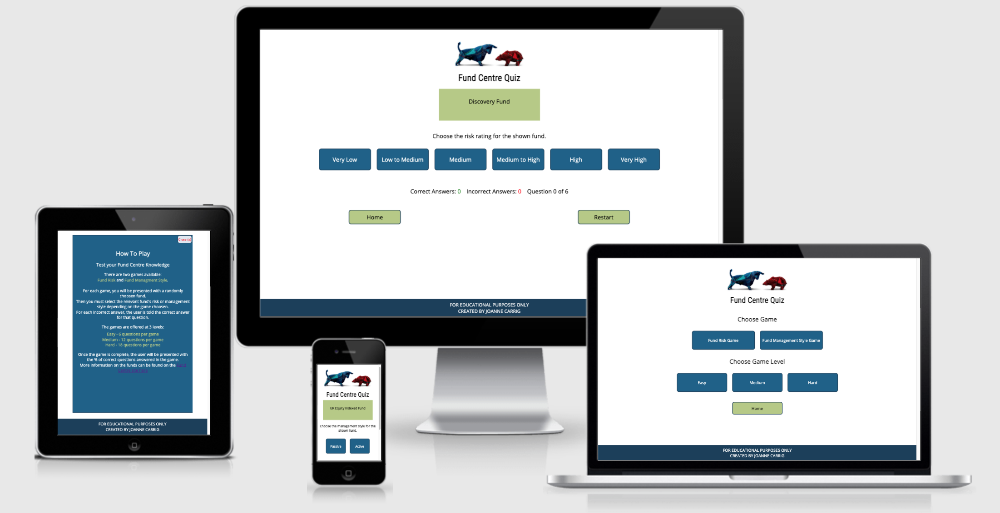

# Fund Centre Learning Game Website

## Introduction

The Fund Centre Learning Game Website was created to enable colleagues of New Ireland Assurance and Bank of Ireland Life to improve their product knowledge in a fun and interactive way to assist them serving customers brilliantly. 

View Live Website [here](https://jojo157.github.io/FundCentreGame/)

Image created using [Am I responsive](http://ami.responsivedesign.is/)

## Table of Contents

- [UX](#ux)
  - [Strategy](#strategy)
    - [User Needs](#user-needs)
        - [As a site user](as-a-site-user)
        - [As the business owner](as-the-business-owner)
  - [Scope](#scope)
    - [Features](#features)
    - [Future Features](#future-features)
  - [Structure](#structure)
  - [Skeleton](#skeleton)
  - [Surface](#surface)
    - [Colour Scheme](#colour-scheme)
    - [Typography](#typography)
    - [Images](#images)
- [Testing](#testing)
    - [Development Issues](#development-issues)
    - [Code Validation](#code-validation)
        - [Html](#html)
        - [CSS](#css)
        - [Javascript](#javascript)
    - [Performance Testing](#performance-testing)
    - [User Stories Testing](#user-stories-testing)
    - [Functionality Testing](#functionality-testing)
    - [Validation Testing](#validation-testing)
    - [Compatibility Testing](#compatibility-testing)
        - [Different devices](#different-devices)
        - [Different Browsers](#different-browsers)
        - [Different Operating Systems](#different-operating-systems)
- [Technologies Used](#technologies-used)
    - [Frameworks and Libraries](#frameworks-and-libraries)
    - [Version Control](#version-control)
    - [Other Programs](#other-programs)
- [Deployment](#deployment)
- [Credits](#credits)
    - [Code](#code)
    - [Content](#content)
    - [Media](#media)
    - [Acknowledgements](#acknowledgements)

## UX

The 5 planes of User Experience:

### Strategy

The Fund Centre Game was created with the purpose of providing a solution to make it easy and fun for our sales and customer support colleagues to become more familiar with our investment fund offering. The game will help them to associate the risk level and management style with the funds we offer. Game-based learning has been shown to be a more effective training method than e-learning. An employee will perform better on a learning task when presented with an engaging and stimulating environment. 

#### User Needs

##### As a site user
- I want to be able to learn about the funds available and the risk that fund has.
- I want to be able to learn the fund management style in an effortless way.
- I want to contact the site owner to request more information about any particular funds or give feedback if needed.
- I want to be able to increment my knowledge at a pace that suits me. 
- I want to feel encouraged to continue learning. 

##### As the business owner
- I want my employees to engage with the funds that we offer to learn the risk and management style.
- I want them to go to our fund centre website to learn more after completing the game.
- I want my employees to be able to upskill in a flexible manner by offering a website that is accessible outside the intranet.

### Scope

#### Features 

The following features are in scope for this project.

- Game Instructions
    - Clear instructions to guide the user on how to play.
- Contact Form
    - A contact form to allow the user to send a message directly to the site owner. An API will send this form data to the site owner by email.
- Game setup Page
    - This allows the user to select between 2 different games and three game levels. The relevant game/level then loads.
- Game Level Option
    - The user can choose between Easy, Medium and Hard Game Level.
- Fund Risk Game
    - The user will be presented with a random fund and risk level options and alerted when get question right or wrong. 
- Fund Management Style Game
    - The user will be presented with a random fund and management style options and alerted when get question right or wrong.   
- Score card
    - During an active game, the user can see the number of correct and incorrect answers. The user is also shown the total number of questions in the game, so they know how many they have left to complete the game. At the end of a game, the user will be given their final score. 
- Restart button
    - The user can choose to restart a game at any time.
- Home Button
    - The user can navigate to the home page and decide to change game or level at any stage when in an active game. The page logo also acts to allow the user to return to the home page at any stage. 
- Sound Alerts
    - When a user gets an answer wrong, they are given a wrong beep sound and the correct answer is shown. When a user gets an answer right, they get a positive sound and congratulated. 
- 404 Error page
    - A custom 404 error page if the user navigates to a resource that does not exist with a button to return home. 

#### Future Features 

The following features are not in scope for this project:

- Player leader board
    - When I learn more about databases, I would like to add a leader board page that when a game finishes the user can submit their score and level to be tracked. This would encourage learning by adding interaction and competition between colleagues. By using a database the data can be updated and stored accordingly for each user that plays.

### Structure

During the planning stage, it was decided that the following pages would be needed to ensure the user needs are meet:

- Landing Page with elements:
    - To tell user how to play.
    - To give user the options to choose game and level.
    - To allow user to contact site owner.

- Game Page with areas:
    - To show the random fund.
    - To give the user answer options.
    - To track score.
    - To give the correct answer, when wrong answer chosen.
    - And controls to navigate those areas.

### Skeleton

Wireframes for this project were created using Balsamiq and can be viewed at below link.

Link to [Wireframe](Assets/Wireframes/fundCentreWireframes.pdf)

### Surface

The Fund Centre Game was designed to be consistent with New Ireland Assurance's Website. By replicating the main colour scheme and styling, the aim is to create an automatic association with New Ireland Assurance's brand. 

#### Colour Scheme

To obtain the hex colours used on [New Ireland Assurance website](https://www.newireland.ie/) the tool [Color Combos](https://www.colorcombos.com) was used. The colour scheme is presented in the image below:

#### Typography

To mimic the text styling found on New Ireland Assurance's website, I used Google Developer tools to check the font family for different text sections.

The New Ireland Assurance's website uses Din Pro for headings and Verdana for general text. As these texts were not available in goggle fonts, I found free alternatives that matched the styling. For Din Pro , I used Roboto Condensed and for Verdana, I used open sans. 

#### Images

I wanted to use a logo that was relevant to a game about investment funds. The image chosen represents a bear and bull market. A bear market is when stock prices are continually decreasing, whereas a bull market is when stock prices are continually increasing. The number of images used was kept to a minimum to increase website performance. 

## Testing

During development, testing was conducted at every step, mainly using the console to log results and check for errors. Minor issues that were quickly resolved are not noted in this Readme but details of changes are included in the project commits. Issues that took longer to resolve are discussed below. 

### Development Issues

- The fund risk level for the fund displayed on screen was incorrect when the checkAnswer function was called. I noticed that the fund answer for the first question was being given for all the following questions within the game. This was caused by a declared variable and its scope. To resolve the issue, I removed the declared variable and accessed the DOM to check the risk level for the fund shown from the relevant array. The checkAnswer function works as intended now. 

- I wanted to be able to pass the user selected game level from the Game Load page to the Game page. I had tried using session storage but realised this is independent for each page as the document is updated. I discovered a suggestion on Stack Overflow to add the variable to the page address and then extract the variable from the address on the Game page. I created a function for both pages to achieve this result and the game level is now passed to the game. 

- I wanted to prevent repeat fund questions within the same game. My first function gave an error of "Uncaught RangeError: Maximum call stack size exceeded". After debugging the function at different lines, I realised the variable I had expected to be false was resulting in true. This had created an infinity loop calling my function. I then changed my code and checked that the result was as expected. The next error was given when the repeat question fuction returned true. The error was "Uncaught Type Error: Cannot read property '0' of undefined". I then went through the function line by line, identified the issue and created a conditional statement to handle the event to ensure there was no Type Error and a new unique fund was displayed instead of the repeat question. This was tested using the console to view the outputs as the game was played and to identify when a repeat question was encounted and how the code responded. All questions in a game are now unique. 

### Code Validation

#### Html

Html pages were validated with [W3C Html Checker](https://validator.w3.org/nu/). 

All pages successfully had no errors. All pages gave the Warning : The type attribute is unnecessary for Javascript resources as per image below:

After doing some research online I discovered that with html5 the need for type was made redundant. To ensure I am keeping with the most up to date standards and my code is compliant, I removed the type attribute and re-tested the code. All pages showed no errors or warnings as per image below: 

#### CSS

CSS page was validated with [W3C CSS Validator](https://jigsaw.w3.org/css-validator/)

No errors were found. Several warnings were given for: -webkit-flex-direction is an unknown vendor extension. After looking up this warning, the consensus from the coding community is that it can be ignored as the extension makes the code compatible with older browsers but for newer browsers one doesn't need this CSS. 

#### Javascript

Javascript files were validated with [JSHint](https://jshint.com/)

Errors
- Undefined variable $
    - As JSHint was not aware jquery is being used, I needed to add `const $ = window.$` to the beginning of my Javascript files to prevent an error occurring.

Warnings
- 'let' is available in ES6 (use 'esversion: 6') or Mozilla JS extensions (use moz). 
    - to fix this warning, i added `/*jshint esversion: 6 */` to all of my Javascript files as recommended. 
- Warnings were given for missing semi-colons . 
    - These were updated accordingly. 
- Functions declared within loops referencing an outer scoped variable may lead to confusing semantics.
    - The functions were updated to improve semantics where applicable. The remaining functions where this warning is given are in the format:
    `for(let game of games){game.addEventListener("click", function(){ ...})}`

After following the guidance provided and re-running all Javascript files through validation, no errors were presented as shown below.

### Performance Testing

Performance was tested using Lighthouse, one of Google's web developer tools.

#### Home Page

After testing the performance, I could see that my logo image was larger than needed for the site. I resized the logo image to improve the performance. 

To improve the best practices score, I followed the advice and added the `rel="noopener"` property to all of the anchor links. Given the absence of this property poses a security risk, it is advisable to follow the best practices advise. 

To improve the search engine optimisation score I added a meta description and changed the link descriptive text from "here" to the name of the link. 

#### Set up Game Page

The resizing of the logo improved the performance of all pages. The accessibility was improved by changing the text colour of the home button from white to black to make it stand out from the surrounding buttons with white text. To improve the search engine optimisation score I added a meta description.

#### Risk Game Page

The reduction in the logo image size improved the performance. A meta tag was added to improve the search engine optimization.

#### Fund Management Game Page

The reduction in the logo image size improved the performance. A meta tag was added to improve the search engine optimization.

#### Contact Page

The reduction in the logo image size improved the performance. A meta tag was added to improve the search engine optimization.

### User Stories Testing

The user's needs are met as follows:

- I want to be able to learn about the funds available and the risk that fund has.
    - The fund risk game gives the user the opportunity to learn about all the funds that are on offer. The user is presented with a random fund name and by choosing the risk type the user either gets it wrong and is presented with the right fund allowing a connection to be made in their memory. If the user gets the answer right, they are congratulated, again reinforcing the link between the fund and risk chosen. 

- I want to be able to learn the fund management style in an effortless way.
    - As per above need, the management style game operates in the same manner. The gamification of the fund management style and fund risk makes it easy for an employee to learn in a fun manner by receiving feedback as they progress through the game. 

- I want to contact the site owner to request more information about any particular funds or give feedback if needed.
    - The contact button on the home page allows the site user to fill in their message to be emailed to the site owner. The site owner can then respond directly to the given users email address with follow up information. When the user fills in the form, they receive an alert to let them know an email has been sent and that they will get a response shortly. 

- I want to be able to increment my knowledge at a pace that suits me. 
    - Both games offer 3 difficulty levels where the user is presented with a set number of questions per game. The number of questions per game is 6 for easy,12 for medium and 18 for hard. As the employee feels more confident in their knowledge they can choose to answer more questions per game and improve their knowledge. 

- I want to feel encouraged to continue learning. 
    - Positive reinforcement messages are given to the user to keep them encouraged to learn. When they get an answer correct, a positive sound is played before they get the alert informing them of the correct answer. When a game is over, the user is given their score as a %, and they are invited to try again and check the fund centre website. Additionally, on choosing the game, the message box encourages users with the wording "are you up for a challenge" before they choose the level to play. 

- I want my employees to engage with the funds that we offer to learn their risk and management style.
    - The funds given in the game are extracted from the official fund centre website. The game allows the user to interact with the funds by learning their risk and management style.

- I want them to go to our fund centre website to learn more after completing the game.
    - A link to the fund centre in the How to play window encourages the user to explore the funds more. The end of game message encourages the user to visit this resource.

- I want my employees to be able to upskill in a flexible manner by offering a website that is accessible outside the intranet.
    - As the website is available 24/7 and accessible on any device that is connected to the internet, the game offers a flexible learning experience.

### Functionality Testing

I tested the functionality of the site on a laptop first. Each page was tested and results are given below:

| **Page**     | **Functions checked** | **Working Correctly** |
| --- | --- | --- | 
| **Home** | | |
|           | All buttons open correct page when clicked | ✓|
|           |  Logo link reloads home page | ✓|
|           | Fund Centre Link loads fund centre in new window | ✓ |
|           | The instructions window disappears when click X button| ✓ |
|**Start Game** |  | |
| | When click game button, alert pops up to advise game selected and asks user to select level| ✓|
| | Click Easy - after selecting game - relevant game loads showing 0 of 6 questions | ✓|
| | Click Medium - after selecting game - relevant game loads showing 0 of 12 questions | ✓|
| | Click Hard - after selecting game - relevant game loads showing 0 of 18 questions | ✓|
| | Home button works| ✓|
| | Logo links to home page| ✓ |
|**Contact** | | |
| | After filling in form user gets correct alert| ✓|
| | After form submitted, user is returned to home page| ✓|
| | If form data is missing, user gets an alert| ✓|
| | Logo links to home page| ✓ |
|**Fund Risk Game**| ||
| | Home Button works| ✓|
| | Logo links to home page| ✓ |
| | Restart Button restarts game correctly| ✓|
| | Each game is different | ✓|
| | All answer buttons function correctly | ✓ |
| | Random Fund Given for each question in game | ✓ |
| | No repeated questions in the same game | ✓ |
| | Correct answer total updates accordingly| ✓|
| | Incorrect answer total updates accordingly| ✓|
| | Question X of Y updates correctly where x is the number of answered questions and Y is the number of total questions for game| ✓|
| | Incorrect answer, outputs wrong beep sound then alert with correct answer| ✓|
| | Correct answer, outputs correct beep sound then alert with congratulations| ✓|
| | Game ends when answered total number of questions for the game| ✓|
| | At game end - alert given with result | ✓|
|**Management Style Game**| ||
| | Home Button works| ✓|
| | Logo links to home page| ✓ |
| | Restart Button restarts game correctly| ✓|
| | Each game is different | ✓|
| | All answer buttons function correctly | ✓ |
| | Random Fund Given for each question in game | ✓ |
| | No repeat questions in the same game | ✓ |
| | Correct answer total updates accordingly| ✓|
| | Incorrect answer total updates accordingly| ✓|
| | Question X of Y updates correctly where x is the number of answered questions and Y is the number of total questions for game| ✓|
| | Incorrect answer, outputs wrong beep sound then alert with correct answer| ✓|
| | Correct answer, outputs correct beep sound then alert with congratulations| ✓|
| | Game ends when answered total number of questions for the game| ✓|
| | At game end - alert given with result | ✓|
|**404 error page**| ||
| | The 404 custom error page appears if the user navigates to a resource that doesnt exist| ✓|
| | A home button is present, when the user clicks the button they are brought to the home page| ✓|

All testing was repeated on a mobile device and all functions listed above are working correctly. 
   
### Validation Testing

The contact form was tested by leaving each input blank and trying to submit the form. The correct validation message was given for each input except the textarea. I had forgotten to include the required parameter and updated this. I've re-tested the contact form and all fields are working as expected now. 

### Compatibility Testing

#### Different devices

Using Google Developer tools, I viewed the website on the following devices:
- Galaxy S5
- Pixel 2
- Pixel 2 XL
- iPhone 5/6/7/8 & Plus
- iPhone X
- iPad & iPad Pro
- Surface duo
- Galaxy fold

Based on the results I decided to add more custom styling using media queries for each page. The main changes made were to increase the size of elements on larger screens and reduce the white space, while preserving the overall layout as I wanted the user experience to be consistent across all devices. After adding further CSS, I have re-run the CSS validation to ensure no errors had occurred in the meantime. 

While viewing the page on different sized screen devices, I realised that that the logo was not exactly centered on some devices. I changed the display to block, allowing the use of text-align centre for the image and this fixed the bug. 

On the game setup page, on IPhone 5 on Google developer tools, the option buttons container was bigger than the width of the device. This was causing a display issue. I fixed the issue with a media query for smaller mobile devices to reduce the margin between level buttons to ensure all content fits within the viewport width. 

#### Different Browsers

I tested the website on:

- Google Chrome
- Safari
- Firefox
- Microsoft Edge
- Internet Explorer

Differences discovered across browsers:

- If using autofill, the auto filling of the form field changes the cell background colour. The cell colour varies depending on the browser.

- The alert box appears different on different browsers. Additonally, on Firefox , when playing any game, the browser asks the user if they want to "Prevent this page from creating additional dialogues" when the alert window with the answer message pops up. This is a feature of the browser but it can cause an issue if the user hits prevent and then the game messages don't appear.

To prevent this from happening, I did some searching online to see what other developers have done to obtain the same functionality. I discovered that a modal dialog could be used to keep the message window consistent across browsers and prevent the built-in security features from confusing the game user. To achieve this, I have used the Bootstraps Modal. I reviewed this feature on all browsers and the display is more user friendly and consistent across browsers. 

- On Internet Explorer 11 (IE 11) on the home page the buttons are not distibuted with the flex column CSS styling and sit on top of each other. I firstly used [autoprefixer](https://autoprefixer.github.io/) to add vendor prefixes to increase browser compatibility. After checking caniuse.com, I realised that the spacing used is not compatible on IE. I targeted IE with a specific media query to give the home page a similar layout and this fixed the layout problem.

- On IE 11 , the modals were not working at all. I added a meta tag to improve compatibility. I read that the fade class is not compatible with IE11. After removing the class, the modal was still not appearing. I debugged the issue by changing the display property of the modal button from hidden to visible. Clicking the modal button, proved the modal is working correctly and highlighted an issue with the javascript file.  Further testing shows the jquery lines in my file are causing the issue. As my only access to Internet explorer is through my work computer, with security settings I did not have access to the console on IE. I continued to trial and test other possible known compability issues using stack overflow. This was still proving difficult without being able to pinpoint the issue. 

    - I obtained a laptop with IE that had access to developer tools. The first error that appears is that my for/of loop was expecting a ; in the conditional statement. Looking up this error, I realised that IE is not compatible with for/of loops. I restructured my for loop to be: `for(i=0; i< dataArray.length; i++)`.

    - The next error that the console gave was that Promise is undefined. I looked up to see why this occured on IE11 and discovered that you need to include a Polyfill to make it work in Internet Explorer according to [Stack Overflow](https://stackoverflow.com/questions/42533264/getting-error-promise-is-undefined-in-ie11). I added this script and re-tested. Finally, the game setup page is working as intended on IE.

    - I then started working on the game page, but even after fixing the same issues as mentioned above, there were more compatibility issues arising. After trying many different troubleshooting steps, I decided to use Gits version control to revert my files to before I made the changes, as parts of my site that were working started to give errors. Given the time constraint of the project, I reached out to the student support in my course and they advised that as IE is being used less frequently, that I should not focus on this browser's issues for the project as its use is rapidly declining with time. 

    - I then added in an alert that would display when a user visits the landing page using Interent Explorer only to tell them to use another browser. This was achieved using navigator.appName as documented on [W3Schools](https://www.w3schools.com/jsref/prop_nav_appname.asp) but this only covered Internet explorer until version 10. To include version 11, I followed the advise on [stackoverflow](https://stackoverflow.com/questions/21825157/internet-explorer-11-detection) and included window.msCrypto as it is only implemented on IE11. Using an if else statement, I tested that my newly added code only gave the alert on IE. The alert message is shown below. 

After submitting my project, I intend to fork my repository to work on the Javascript files and make them compatible with Internet Explorer aswell. 

#### Different Operating Systems

The above testing was conducted on below operating systems:

- Windows 8.1
- MacOS Big Sur 11.2.3
- iOS 14.4.2
- Android

There were no differences detected on those operating systems. [Browser Stack](live.browserstack.com) was used to view and check the functionality across a wide range of devices and operating systems.

## Technologies Used

### Frameworks and Libraries

- [Google Fonts](https://fonts.google.com/) was used to import the font selectedfor the website.
- [jQuery](https://jquery.com/) was used as a Javascript library.
- [Bootstrap](https://getbootstrap.com/) was used for creating the modals on the website to ensure the message box was consistent across browsers. 

### Version Control

- [Git](https://git-scm.com/) was used as a version control system.
- [GitHub](https://github.com/) was used for the repository hosting.
- [Gitpod](https://www.gitpod.io/) was used as the developer platform.

### Other Programs

- [Balsamiq](https://balsamiq.com/) was used to create a mock-up of the website after exploring the strategy and scope planes of user experience for this project.
- [Color Combos](https://www.colorcombos.com) was used to extract all the hex colours used on the New Ireland Website and create the colour scheme for this project.
- [Shuttle Stock](https://www.shutterstock.com) was used for the logo image.
- [W3C CSS Validator](https://jigsaw.w3.org/css-validator/) was used to validate CSS code.
- [W3C Html Checker](https://validator.w3.org/) was used to validate HTML code.
- [Pic Resize](https://picresize.com/) was used to resize images available on the website, improving its performance.
- [Ligthhouse](https://github.com/GoogleChrome/lighthouse) was used to audit my website. The results of the audit were considered when making improvements to the website's performance etc.
- [Am I responsive](http://ami.responsivedesign.is/) was used to view the website across several devices at once.
- [W3C Spell checker](https://www.w3.org/2002/01/spellchecker) was used to check the spelling of the website.
- [Free Sound](https://freesound.org/) was used to get the sound files used in the game. 
- [Can I use](https://caniuse.com/) was used to check browser supports range and potential compability issues and known bugs. 
- [Browser Stack](live.browserstack.com) was used to test the website on different operating systems and browsers.
- [Favicon from Pics](http://favicon.htmlkit.com/favicon/) was used to create a favicon to be used in the address bar.

## Deployment

This milestone project was deployed to GitHub Pages using the below steps:

- Log into GitHub and locate the [Fund Centre Game](https://github.com/jojo157/FundCentreGame) repository.
- At the top of this page navigate to "Settings" on the menu.
- Scroll down until you reach the "GitHub Pages" Section on the settings page.
- Click on the 'Check it out here!' hyperlink.
- Under "Source", click the dropdown called "None" and select "main" branch.
- The page will automatically re-load.
- At the top of the page you will see the site published address displayed.

To copy the repository so that you have access to all the files and any new changes will not affect the original repository follow the below steps:

- Log into GitHub and locate the [Fund Centre Game](https://github.com/jojo157/FundCentreGame) repository.
- On the top far right click on the fork button.
- This will add a copy of Fund Centre Game to your repository.

You can add the Fund Centre Game repository to your local machine using the below steps:

- Log into GitHub and locate the [Fund Centre Game](https://github.com/jojo157/FundCentreGame) repository.
- Click the "Code" button, click HTTPS and copy the link shown.
- Open terminal and change the working directory to where you want the clone repository to be.
- In the terminal, type git clone, and then paste the URL you copied earlier.
- Press enter and your local clone is now created.

## Credits

### Code

- [Email js API](https://www.emailjs.com/docs/) code template for using emailjs provided in their documentation was used to implement the email template API on the contact page when the form is submitted.
- [Bootstrap](https://getbootstrap.com/) was used to implement the modal across pages.
- [CSS Tricks](https://css-tricks.com/snippets/css/a-guide-to-flexbox/) was used as aguide for using the CSS flexbox. 
- To import the text files [Stack Overflow](https://stackoverflow.com/questions/26656260/importing-data-from-a-text-file-into-an-array-using-javascript/26656364) provided assistance and help with the code. 
- To create the floating pop up div, an essential resource was [Encode DNA](https://www.encodedna.com/2012/12/floating-div-using-css.htm) .

### Content
- The funds for the game were extracted from [Bank of Ireland Life Fund Centre](http://fundcentre.bankofirelandlife.ie/#).
- The colour scheme is based on the [New Ireland Assurance](https://www.newireland.ie/) website. 

### Media

- The logo image was obtained from [Shutterstock](https://www.shutterstock.com/image-vector/bull-bear-shapes-that-look-like-218090794).
- Correct answer sound was obtained from [Free Sound](https://freesound.org/people/Eponn/sounds/421002/).
- Incorrect answer sound was obtained from [Free Sound](https://freesound.org/people/TheBuilder15/sounds/415764/).

### Acknowledgements
- I would like to thank Bank of Ireland Life / New Ireland Assurance for the content for the game.
- I would like to thank my mentor Spencer Barriball for his help, encouragement and advice. 
- I would like to thank Code Institute's Tutor support for their help throughout the course.
- I would like to thank my fellow students for their help on slack. 
- I would like to thank my wife Leticia for her continued support. 
- I would like to thank Stack Overflow and W3Schools for their content when trouble shooting as these resources were essential to work out how to correct my code. 